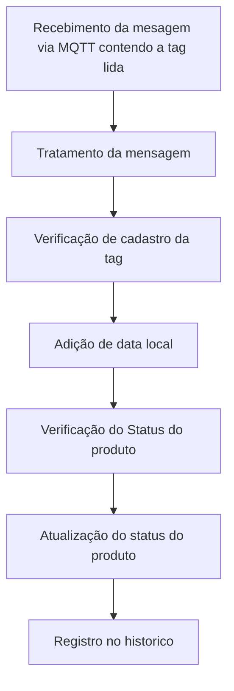

<div  Align="justify">
  
# Sumario
- [Objetivo do Trabalho](#Objetivo-do-Trabalho)
- [Funcionamento](#Funcionamento)
- [Mode de Execução](#Mode-de-Execucao)
- [Hardware](#Hardware)
- [Software](#Software)
  - [Node-red](##Node-red)

# <a name=“Objetivo-do-Trabalho”><a/>Objetivo do Trabalho
A automatização do processo de inventário em armazéns é uma necessidade para garantir a eficiência e a precisão dos estoques. A discrepância entre o sistema virtual e a quantidade física de estoque é um problema comum nas empresas, mas pode ser resolvido com o uso de tecnologias como a identificação por radiofrequência (RFID). A utilização de drones equipados com essa tecnologia permite uma identificação mais rápida, precisa e eficiente dos produtos, além de oferecer vantagens em termos de rapidez, precisão e redução de custos em comparação com outros métodos de catalogação. Com a adoção da automatização do processo de inventário, é possível aumentar a eficiência logística, garantir a satisfação do cliente e melhorar a gestão de recursos.

A **RFlyD** traz uma tem como objetivo a integração de drone, RFID e site proprío para gestão autônomo de um inventario.
# <a name=“Funcionamento”><a/>Funcionamento


# <a name=“Mode-de-Execucao”><a/>Mode de Execução
# <a name=“Hardware”><a/>Hardware
# <a name=“Software”><a/>Software
## <a name=“Node-red”><a/>Node-red
Inicialmente, temos todos os nodes separados em dois fluxos: o **Receive Data** e o **Postgres**. No primeiro fluxo, o **Receive Data**, temos o processo de recebimento, tratamento e adição de informações. Já no segundo, o **Postgres**, temos os nodes responsáveis pela comunicação entre o Node-RED e o banco de dados PostgreSQL. 



É importante ressaltar que em ambos os fluxos são utilizados subflows para simplificar o processo. Abaixo, seram destacados suas funcionalidades.

>### <a name=“receive-data”><a/>Receive Data

<div align="center">
    <br> 
</div>

O fluxo de dados no receive se da na aquisição dos dados que veem via mqtt no subflow ***MQTT***, que posteriormente são tratados pelo subflow ***Tratamento da mensagem*** onde as mensagem são tratadas e posteriormente e adicionado a data no subflow ***Date***.

Logo abaixo temos uma mensagem que chega do medidor referente à corrente de fase A:

```json
{
  "packet": {
    "cmd" : "publish",
    "retain": false,
    "qos": 0,
    "dup" : false,
    "length" : "58",
    "topic" : "RFID",
    "payload": buffer[42]
  }
  "client":{}
}
```

Percebe-se que esta mensagem, além de conter o payload no formato buffer, contém também todos os dados do MQTT, como configuração de tópico, subtop, entre outros, sendo simplificada para se tornar:
```json
{
  "id" : "publish",
  "topic" : "RFID",
  "tag": 1902835DE
}
```
>### <a name=“postgres”><a/>Postgres

<div align="center">
    <br>
</div>

O fluxo do Postgres funciona como uma ferramenta de conexão entre o Node-RED e o banco de dados, permitindo diversas interações com o banco. Por exemplo, é possível verificar o cadastro de uma determinada tag, atualizar o status de um produto, atualizar o historio de possicionamento de um produto e Manter a sincronização da usuabilidade da antena de acordo com o site.

Dentro desse fluxo, temos vários subfluxos que facilitam o trabalho com o banco de dados. Por exemplo, o subfluxo ***Verifica cadastro*** faz requisições ao banco remoto para averiguar informações. O subfluxo ***Atualiza Checked*** que é responsável por alterar de tempos em tempos o status de todos os produtos para falso, a fim de acarretar uma nova leitura utilizando o drone, e temos também o subfluxo ***sincronismo Rele*** que de tempos envia uma mensagem para o tópico RFID a fim de se comunicar com o NoceMCU e manter atualizado nele a informação de que a antena deva funcionar como carregador por indução ou leitor RFID, o valor enviado ao NodeMCU é pego diretamente do banco de dados.

# Autores
| [<br><sub>Arthur Coelho Estevão</sub>](https://github.com/arthurcoelho442) |  [<br><sub>Milena da Silva Mantovanelli</sub>](https://github.com/Milena0899) |
| :---: | :---: |

</div>
